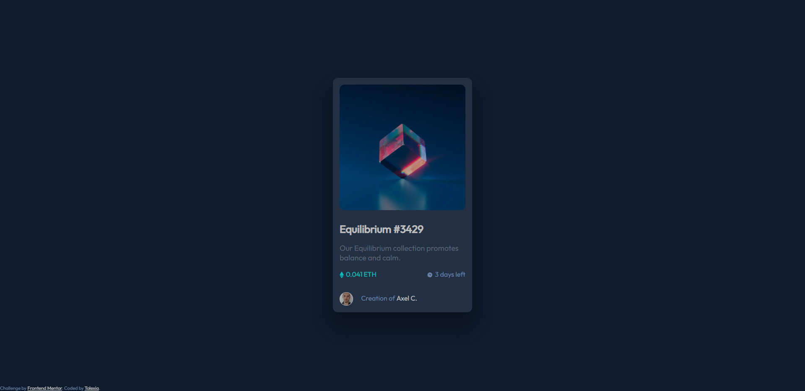
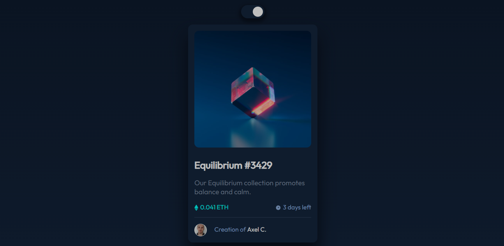

# NFT preview card component 

This is a tiny project inspired by the [NFT preview card component challenge on Frontend Mentor](https://www.frontendmentor.io/challenges/nft-preview-card-component-SbdUL_w0U).  
The colors asked in the specifications were slightly different so I added a toggle switch from the ones asked to ones I prefered.

## Screenshots

### What was asked

### Result

### Link

- Live Site URL: [Github Page](https://tolexia.github.io/nft-preview-card-component/)

## Built with

- Semantic HTML5 markup
- CSS custom properties
- Flexbox

### Useful resources

- [w3schools - How to css switch](https://www.w3schools.com/howto/howto_css_switch.asp) - Remembered how to make a nice switch

## Author

- Frontend Mentor - [@Tolexia](https://www.frontendmentor.io/profile/Tolexia)
- Github - [@Tolexia](https://github.com/Tolexia)

