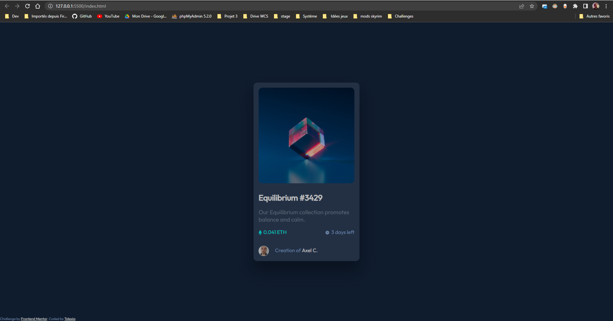
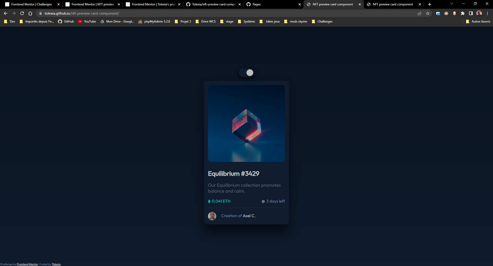

# Frontend Mentor - NFT preview card component solution

This is a solution to the [NFT preview card component challenge on Frontend Mentor](https://www.frontendmentor.io/challenges/nft-preview-card-component-SbdUL_w0U). Frontend Mentor challenges help you improve your coding skills by building realistic projects. 

## Table of contents

- [Overview](#overview)
  - [The challenge](#the-challenge)
  - [Screenshot](#screenshot)
  - [Links](#links)
- [My process](#my-process)
  - [Built with](#built-with)
  - [What I learned](#what-i-learned)
  - [Continued development](#continued-development)
  - [Useful resources](#useful-resources)
- [Author](#author)
- [Acknowledgments](#acknowledgments)

## Overview

### The challenge

Users should be able to:

- View the optimal layout depending on their device's screen size
- See hover states for interactive elements

### Screenshot

#### Challenge screenshot

#### Final screenshot

### Links

- Solution URL: [Add solution URL here](https://github.com/Tolexia/nft-preview-card-component)
- Live Site URL: [Add live site URL here](https://tolexia.github.io/nft-preview-card-component/)

## My process

### Built with

- Semantic HTML5 markup
- CSS custom properties
- Flexbox

### Useful resources

- [w3schools - How to css switch](https://www.w3schools.com/howto/howto_css_switch.asp) - Remembered how to make a nice switch

## Author

- Frontend Mentor - [@Tolexia](https://www.frontendmentor.io/profile/Tolexia)
- Github - [@Tolexia](https://github.com/Tolexia)

